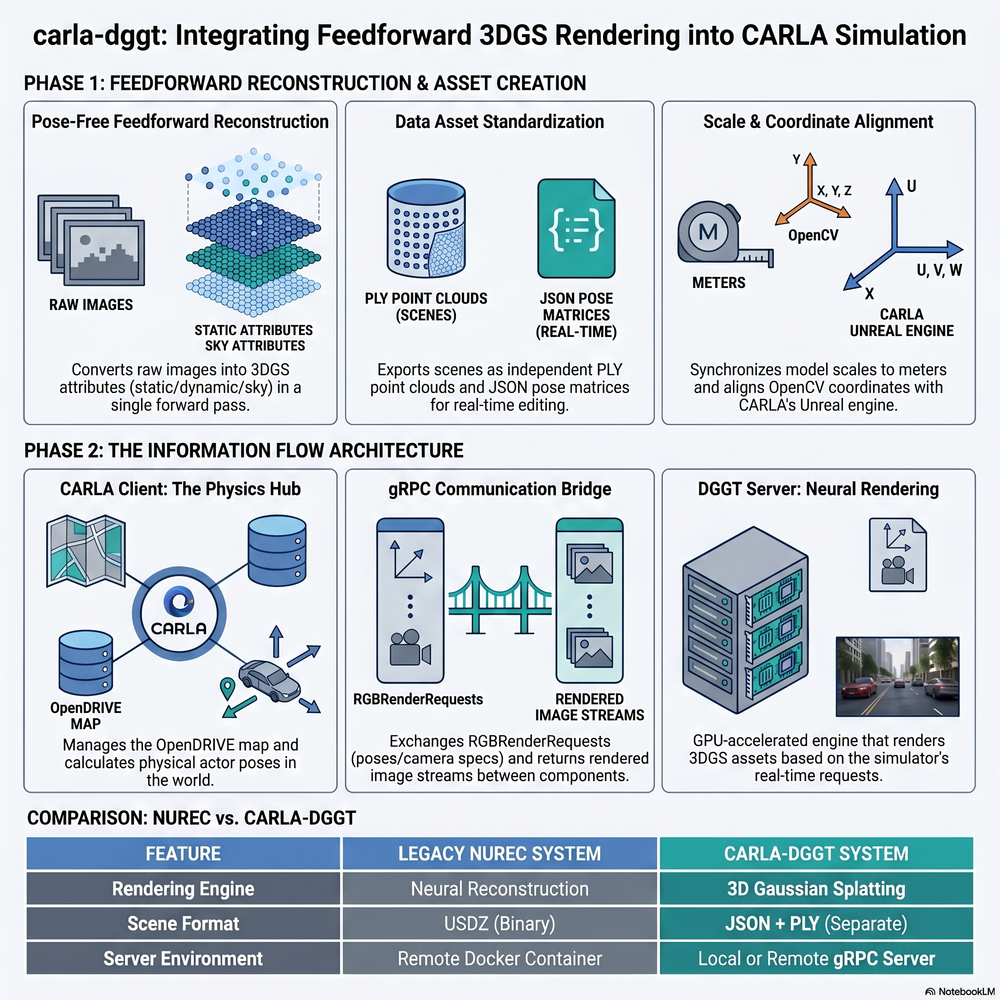
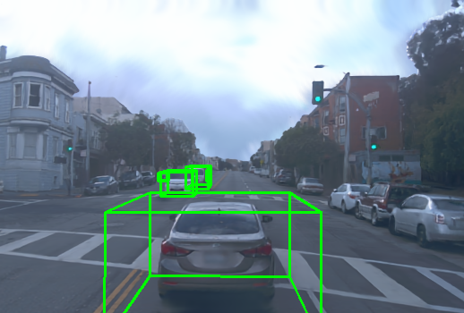

# CARLA-DGGT: Use Feedforward 4D Reconstruction with CARLA



## 📖 Introduction

**carla-dggt** is an experimental project that explores the integration of feedforward 3D Gaussian Splatting (3DGS) into closed-loop autonomous driving simulation. It serves as an open-source, highly customizable alternative to the official NVIDIA NuRec integration in CARLA 0.9.16+.

By leveraging the **DGGT (Driving Gaussian Grounded Transformer)** framework, this project enables the reconstruction of editable 3D scenes directly from unposed RGB images in a single forward pass, effectively filling the "last piece of the puzzle" for scalable simulation.

[](https://www.bilibili.com/video/BV1CHR1BTENv/)

[](https://www.bilibili.com/video/BV1CJR1BBEW2/)

[代替NVIDIA NuRec，CARLA-DGGT使用前馈重建与仿真软件联合仿真](https://mp.weixin.qq.com/s/yQiqC8vvOeXfA8iYlyOhWQ)

### 🚀 What This Project Does

The core objective of `carla-dggt` is to replace the closed-source NuRec Render Server with a self-developed **DGGT Render Server**, allowing for deep customization of the rendering pipeline and digital assets.

1. **Advanced Inference & Asset Export**: We modified the original DGGT inference pipeline to export "atomized" digital assets, including static backgrounds, sky models, and frame-wise dynamic objects stored in local coordinate systems.
2. **Scale & Pose Bridging**: Since feedforward models often output normalized coordinates, we implemented a robust **Metric Scale Recovery** logic and a **Dynamic Yaw Inference** algorithm to align virtual assets with CARLA’s physical world.
3. **gRPC-based Co-Simulation**: We replicated the official `sensorsim.proto` communication protocol. The CARLA client manages physics and actor poses, while our DGGT server performs real-time splatting to synthesize high-fidelity images.
4. **Engineering Hacks for Stability**:
   * **Hybrid Control**: Solves the "drop-shock" issue by using deterministic teleportation for the first 8 frames before handing over control to the PID trajectory follower.
   * **Z-Offset Snapping**: Dynamically "vacuums" the trajectory to the OpenDRIVE road mesh to prevent vehicles from floating or falling through the map.
   * **Dilation Defense**: Expanded dynamic masks during static scene accumulation to eliminate "ghosting" artifacts left behind by moving vehicles.

### 🛠 Architecture at a Glance

| Component | Responsibility | Environment |
| :--- | :--- | :--- |
| **CARLA Client** | Physics engine, OpenDRIVE management, and Pose collection | Host Python |
| **DGGT Render Server** | Feedforward neural rendering and image synthesis via gRPC | Host/Remote GPU |
| **Digital Assets** | Standardized PLY (3DGS) and JSON (Metadata) formats | Unified Storage |

### ⚠️ Current Limitations & Future Work

As a practice project in the realm of AI coding, `carla-dggt` is currently a functional demo with known limitations:
* **Data Redundancy**: Static scene accumulation currently lacks voxel downsampling, leading to large PLY files.
* **Long-Sequence Drift**: Precision tends to degrade in long sequences.
* **Next Steps**: We are working towards **Delta Updates** to reduce gRPC overhead and **Asynchronous Inference Threading** to decouple physics calculation from neural rendering.

---

## ⚙️ Installation

1. Make sure you have compiled and installed CARLA 0.9.16 using the "build from source" method. 
   * Reference: [CARLA 0.9.16 Build Documentation](https://carla.readthedocs.io/en/0.9.16/build_linux/)

2. Clone this repository and copy it into the `PythonAPI/examples/nvidia/nurec` directory within your CARLA root folder.

3. Copy the contents of the `dggt` folder from this project into your original `dggt` project directory.

4. Create and configure the Conda environment:

```bash
conda create -n dggt python=3.10
conda activate dggt

pip install torch==2.4.1 torchvision==0.19.1 torchaudio==2.4.1
pip install -r requirements.txt

# Install CARLA wheel into the dggt conda environment:
python3 -m pip install ${CARLA_UE4_ROOT}/PythonAPI/carla/dist/carla-0.9.16-cp310-linux_x86_64.whl
```

---

## 🏃‍♂️ Running CARLA-DGGT

### 1. Preprocess Datasets
Follow the official DGGT documentation to preprocess the Waymo and nuScenes datasets. 
* Reference:[DGGT Official Repository](https://github.com/xiaomi-research/dggt)

### 2. Generate Simulation Scenes
Run the inference script to generate scenes:

```bash
python inference.py \
    --dataset waymo \
    --image_dir ./data/waymo/processed/training/ \
    --scene_names 1 \
    --input_views 1 \
    --intervals 2 \
    --sequence_length 20 \
    --start_idx 40 \
    --mode 2 \
    --ckpt_path ./pretrained/model_latest_waymo.pt \
    --output_path ./output/waymo/training/scene1/ \
    -images \
    -metrics
```

**Key Command Line Arguments:**
* `dataset`: Determines the scaling factor for metric scale recovery (choose between `waymo` or `nuscenes`).
* `start_idx`: The starting frame index from the original dataset.

The `inference.py` script will save the simulation scenes in the specified `output_path` for the next steps.

**Validation:**
You can modify the relevant paths in `dggt_engine.py` and run it to validate the simulation scenes generated by `inference.py`. Setting `draw_bboxes=True` will draw bounding boxes of separated dynamic objects in the output images, as shown below:



### 3. Add the default OpenDrive map
Put the `data/map.xodr` into scene folders as a default opendrive map for carla simulation. 

### 4. Run CARLA-DGGT Co-Simulation

#### 4.1 Start CARLA
In your CARLA root directory:
```bash
make launch
```

#### 4.2 Start the DGGT Server
Ensure you are in the `dggt` conda environment and navigate to `PythonAPI/examples/nvidia/nurec`, then run:
```bash
python -m dggt_server \
    --scene-path /home/junchuan/e2e/dggt/output/waymo/training \
    --port 50051 \
    --device cuda \
    --log-level INFO
```
*Note: The `--scene-path` should point to the root directory where the simulation scenes are stored (e.g., `output/waymo/training/` which contains `scene0`, `scene1`, etc.).*

#### 4.3 Start the Replay Script
In a new terminal (within the `dggt` conda environment and `PythonAPI/examples/nvidia/nurec` directory), run:
```bash
python example_dggt_replay.py --config configs/dggt_waymo_training_0.yaml --num-frames 20
```
A Pygame window will launch, displaying one DGGT-rendered view alongside three different camera views from the CARLA simulation environment.

For a detailed analysis of the CARLA-NuRec co-simulation architecture, please check out the project wiki:  
👉 [CARLA-NuRec Co-Simulation Deep Dive (Wiki)](https://github.com/GimpelZhang/carla-dggt/wiki/CARLA%E2%80%90NuRec-%E8%81%94%E5%90%88%E4%BB%BF%E7%9C%9F%E8%A7%A3%E6%9E%90)

---

## 🏆 Acknowledgments

*This project is built upon the research DGGT from Xiaomi & Tsinghua AIR. Special thanks to the open-source community for the `gsplat` and `CARLA` ecosystems.*

* **DGGT Project**:[DGGT: FEEDFORWARD 4D RECONSTRUCTION OF DYNAMIC DRIVING SCENES USING UNPOSED](https://github.com/xiaomi-research/dggt)
* **CARLA-NuRec Official Docs**: [Use NVIDIA Neural Reconstruction with CARLA](https://carla.readthedocs.io/en/0.9.16/nvidia_nurec/)

